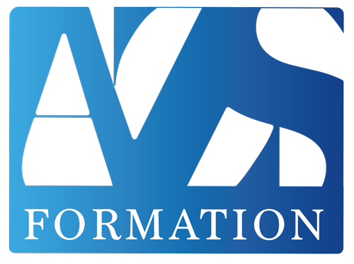

# Dépôt pour la formation : développeur Web et Web Mobile

Tous les exemples des cours en lignes sont disponibles ici. 

- HTML5 - CSS3 : Tous les exemples sont dans Bases-html-css
- Javascript : Tous les exemples sont dans apprendre-javascript et javascript pour le web.
- SQL : Tous les exemples et tables utilisées sont dans SQL.
- PhP : Tous les exemples sont dans le dossier php

Vous pouvez retrouver certains exemples dans le projet dédié sur [codepen.io](https://codepen.io/collection/waovgO)

### Retrouvez tous les détails des parcours sur : 

[azs-learning](https://azs-learning.fr/)

